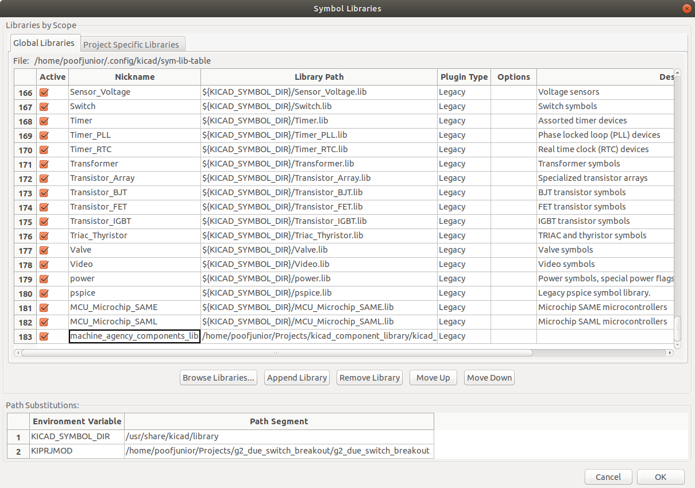
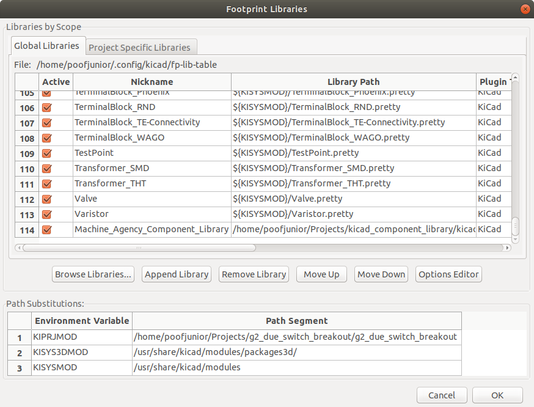
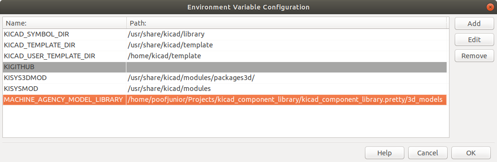

# Kicad-Lib


Two options exist for installation: installing this library (1) into your system or (2) into a specific project as a submodule.

> [!NOTE]
> You may clone this repository via *https* instead of *ssh*, but you will be unable to push changes under the current repository settings.

## System Installation

Navigate to the folder you wish to save this repository.
Clone this repo with:
```bash
git clone git@github.com:AllenNeuralDynamics/kicad-lib.git

```

## Submodule Installation

Navigate to a sub folder of your specified git-versioned project and add this library with:
```bash
git submodule add git@github.com:AllenNeuralDynamics/kicad-lib.git
```

## Installation
The following instructions are the same for both installation types.

1. In EESchema, append the absolute path of the `.kicad_sym` file into the **Symbol Librariy Table** (in Preferences --> Manage Symbol Libraries).

1. In CVPCB, set the absolute path of the .pretty directory into the **Footprint Library Table** (in Preferences --> Manage Footprint Libraries)

1. In the Footprint Editor, set the absolute path of the **3d_models** directory to **AIND_3DMODEL_LIB** (or your specified folder name. (in Preferences --> Configure Paths)


# Creating New Library Symbols

Check the [Reference Designator Listing](https://en.wikipedia.org/wiki/Reference_designator) to see what type of reference your new part should have.

# Creating New Footprints
* Place the footprint origin at the part's centroid.


